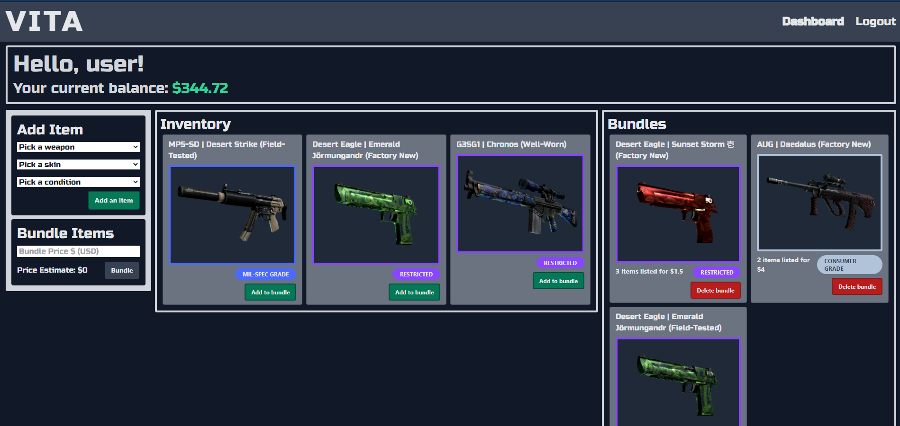

# VITA (Virtual Item Trading App)

## Table of Contents

[Installation](#install) | [Usage](#usage) | [Contribute](#contribute)

## Description

---

This app allows a user to find other gamers who are looking to buy and sell their Counter Strike weapon skins. Seeing as how Steam takes a large percentage of all skins sold on their website, its only fair that some would want to circumvent this cut into their profits, especially if their items are totalling into several hundreds of dollars or more. This app looks to solve this by providing a platform for users to find each other to trade skins instead of selling them on the Steam marketplace at a loss.

## Install

---

After cloning this project, you can run the following command to install all of the required packages

    npm i

Next, you will need to seed the database with weapon and skin information by running this command:

    node seeder/seed.js

## Usage

---

Since there could be several ways to input information into a project, it is important to state how it should be used. The following section describes the functionality of each page:

### Login / Sign-up Pages

- Create a new profile with username, email, password, and steam ID
- Validation on login page for profiles created on sign-up page

---

## 

### Home Page

- View bundles from other users
- Bundles can still be viewed when not logged in
- Bundles have information on amount of items in the bundle, the price of the bundle, and a link to a page to view the bundle in detail.
- The bundles are sortable by a dropdown menu at the top of the screen which lets users find a bundle that contains a specific weapon type

---

## 

### Listings Page

- After clicking on view bundle from the homepage, you will be brought to a page with information on every item in the bundle
- Each individual item has information on average price, lowest price, and quantity traded in the last 30 days
- Clicking on buy bundle will put the skins into your inventory and reduce your balance by how much the bundle cost
  -A message will appear showing that you bought the bundle successfully (shown in image below)
- After a few seconds, you will be redirected to the dashboard page after purchasing the bundle

---

## 

### Dashboard Page

- On the dashboard, you can add items into your inventory
- Setting weapon type, skin name, and condition will create a new item in your inventory that matches its description
- When you have skins in your inventory, you are now able to start creating bundles by clicking the "add to bundle" button on any of the items
- You can add as many skins as you want to a bundle and then set a price for it
- Bundles will appear on the right after a user has created a bundle
- From the dashboard a user can delete their bundle to get it taken off the home page, and get their items back in their inventory

---

## 

## Contribute

---

Code is never really finished being added to, and this addition could come from developers that are not the original creator. The following section describes how to contribute to this project:

For the future development of this app, there are several features that still need to be implemented.

    Users should be able to link their real steam inventories to their profile.

    Users balance should be hooked up to some sort of payment app such as PayPal where they can add money to their balance.

    Users should be able to update an existing bundle to add or remove items.

## Developers

---

Zack Campbell - https://github.com/zax5021

Daniel Carrillo - https://github.com/DanCarrillo93

Adrian Mata - https://github.com/amata7

Oliver Shih - https://github.com/runescape11111
